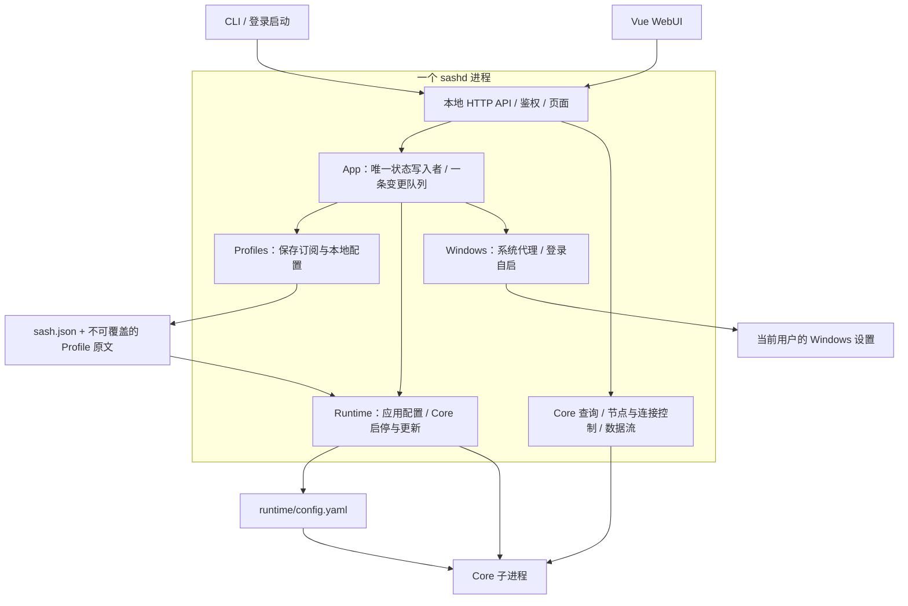

# Sash 高层架构

这是 2026-09-08 架构收缩提案的实施结果。目标是一个 Windows 优先、自用、容易掌控的网络工具：保留 Node.js / TypeScript、Vue 自研 WebUI 和霞鹜文楷，直接使用新状态格式，不提供旧接口或迁移层。

> 说明：本文记录当时这次收缩的结果。`sash upgrade` 后来收缩为一层薄的 npm 封装：解析目标版本、停止管理进程、用 `npm install --global` 安装精确版本、再启动管理进程。下文涉及升级入口的段落以 README 与 [操作指南](./usage.md) 为准。

## 一张图



只需记住五条规则：

1. **正常写操作都进入 daemon。** CLI 负责发现、启动、请求和显示，不安装 Core、不提交配置、不接管事务。
2. **保存不等于应用。** 编辑、选择、订阅更新只改变保存状态；点击“应用配置”才重启 Core。
3. **一个元数据提交点。** 设置、Profile 列表和选择都在 `sash.json`。运行配置是可重新生成的产物。
4. **Core 更新只管二进制。** 不改 Profile，不退出 daemon；失败只回滚二进制及安装记录。
5. **桌面集成只维护 Windows。** 基础 Core / CLI 保留可移植代码，不保留 macOS / GNOME 代理和非 Windows 自启后端。

## 看代码时从哪里进入

| 要理解的事情 | 入口 | 边界 |
| --- | --- | --- |
| 一个用户操作如何执行 | [daemon/app.ts](../src/daemon/app.ts) | 组装服务，排列步骤，取消准备工作 |
| 为什么不会有两个写入者 | [daemon/context.ts](../src/daemon/context.ts)、[daemon/entry.ts](../src/daemon/entry.ts) | 一个进程内队列，启动时取得实例租约 |
| 保存什么、如何提交 | [app-state.ts](../src/app-state.ts)、[profile-service.ts](../src/profile-service.ts) | 新原文先落盘，再原子提交元数据引用 |
| Apply 和启停的顺序 | [runtime-lifecycle.ts](../src/runtime-lifecycle.ts) | 校验后停止、发布、启动、恢复代理意图 |
| Core 更新与回滚 | [core-update.ts](../src/core-update.ts) | 固定二进制事务；下载在 [core.ts](../src/core.ts) |
| Windows 行为 | [system-proxy-manager.ts](../src/system-proxy-manager.ts)、[autostart.ts](../src/autostart.ts) | 代理条件恢复、当前用户登录注册 |
| WebUI 数据为何刷新 | [stores/runtime-events.ts](../web/src/stores/runtime-events.ts)、[stores/core-actions.ts](../web/src/stores/core-actions.ts) | 管理状态经 SSE 推送（详见 [frontend.md](./frontend.md)），Core 数据按当前页面加载 |

不引入工作流引擎、事件总线、数据库或依赖注入框架。底层文件、进程、下载、鉴权工具继续复用。

## 保存状态与运行状态

```text
SASH_HOME/
  sash.json                       schemaVersion: 2，设置、Profile 元数据、所选配置
  profiles/<id>/<revision>.yaml    不可覆盖的原文版本
  runtime/config.yaml             已生成的运行配置
  bin/                            Core；更新完成前保留 .bak
  state/                          进程信息、安装记录、Core 更新与代理恢复记录
  logs/
```

保存原文：解析、限制大小与结构 → 原子写入新版本 → 原子替换 `sash.json`。中途崩溃最多留下未引用的原文，已有引用仍完整。旧原文清理失败不撤销已成功的提交；这些版本用于安全发布，不提供历史版本管理。

Apply：生成候选 → Core 校验 → 恢复系统代理 → 停止已验证的旧 Core → 发布 `runtime/config.yaml` → 启动并验证新 Core → 按保存意图启用代理。

校验失败时旧 Core 继续运行。代理恢复失败时保留健康 Core。新 Core 启动失败时，保存的编辑保留，页面显示待应用；管理界面继续可用。

Core 更新：下载并验证 → 固定本次运行配置 → 停止 Core → 保留 `.bak` 并替换二进制/安装记录 → 健康检查 → 恢复原运行状态 → 清理备份。原本停止时也当场临时启动验证，随后仍停止。升级记录不包含设置或 Profile。

## 命令与界面

| 入口 | 行为 |
| --- | --- |
| `sash web` | 启动管理进程、授权浏览器；Core 可以不存在或保持停止 |
| `sash start` | Core 停止时应用保存配置并启动；已运行时检查健康和代理意图 |
| `sash restart` / WebUI 应用配置 | 应用保存配置并重启 Core，保留 daemon 和浏览器会话 |
| WebUI 停止核心 | 停止 Core，保留管理界面 |
| `sash stop` | 恢复代理、停止 Core、退出 daemon |
| `sash update` | daemon 内完成 Core 更新与验证 |
| `sash auto on/off` | 设置 Windows 登录启动；不带参数只查看状态 |

Sash 程序本身更新使用 `sash upgrade`：先解析 npm 上的目标版本，停止管理进程（Core 与系统代理随之停止/恢复），由 npm 全局安装精确版本，再启动管理进程并保持 Core 停止，需要时用 `sash start` 恢复流量。已授权的浏览器标签页通过上一代会话自动续用；不提供 `update --force`、在线原始设置编辑和配置热加载接口。

## WebUI 保留什么、简化什么

Vue、现有页面、霞鹜文楷及字体切分构建链保留。现有懒加载、浅响应式集合、分页和日志批量更新继续使用。共享 `CoreControls` 处理首页、设置页和全局待应用提示中的启停操作。

前端只区分三种版本：`daemon.bootId` 标识管理进程；`revisions.state` 标识保存状态；`revisions.runtime` 标识 Core 运行变化。重命名、排序和未应用的编辑不会清空节点测速或 Core 缓存。

节点、连接、规则分别加载和记录失败。配置页不拉 Core 表，规则页只需要规则；日志只在可见日志页订阅。会话初始化只在进入或重连时进行，普通轮询无需重复请求 health。

## 保留的安全边界

进程身份无法确认就不终止；loopback 请求直接连接；子进程清理凭据；状态原子写入并保持私有权限；下载必须来自允许的地址并通过官方摘要；解压拒绝越界路径并限制大小；订阅作为不可信 YAML 处理。生成配置始终关闭 TUN，并拒绝独立 TUN listener。

普通业务只有一条队列；实例启动和 Windows 用户级 OS 操作保留必要的跨进程锁。停止/退出可取消下载与配置校验，已经开始的二进制替换按顺序完成。损坏记录不会通过默认值覆盖。daemon 被强杀后的孤儿 Core 和代理状态由下一次取得所有权的启动恢复，不增加第二个看护进程。

完整协议见 [后端架构](./backend.md)，界面刷新策略见 [前端架构](./frontend.md)，使用方式见 [操作指南](./usage.md)。

## 实施结果

与 `c7b2d7546ba7d478fa248f4b8f3a06a685ed7ba1` 比较，按相同范围统计已格式化源码，排除测试与生成文件：

| 范围 | 重构前 | 重构后 |
| --- | --- | --- |
| 后端 | 92 个文件，17,329 行 | 81 个文件，11,196 行（减少 35.4%） |
| 前端 TS / Vue / CSS | 54 个文件，9,179 行 | 54 个文件，8,940 行 |
| 字体产物 | 232 个切片，8,597,176 字节 | 保持不变 |

验证覆盖类型检查、lint、完整测试、生产构建、npm 文件集与实际安装包、隔离管理进程启停，以及 Chromium / Firefox 页面与授权交互。Core/代理故障场景使用隔离测试适配器；Windows 注册表脚本只在临时测试键运行。没有对用户当前实例操作，也没有用这些结果宣称真实 Core 的 CPU 或内存改善。

## 2026-09-11：按必要性做消融

基线为 `2b2a4f9`，环境为 Windows、Node 24.13.0。每个代码实验都从同一基线独立修改，依次运行类型检查、lint 和相关测试；通过的改动最后合并。基线覆盖 17 个相关测试文件、117 个测试，全部通过。所有实例和数据均隔离在临时目录，未操作用户实例。

| 实验 | 删除的机制 | 结果 | 决定 |
| --- | --- | --- | --- |
| A | `SashClient` 的 `expect<T>` 函数和 26 处包装调用 | 33 个测试通过；成功响应在请求入口统一标注类型，鉴权、错误解析和请求选项保留 | 删除包装 |
| B | 状态仓库的第二份状态对象、缓存失效字段和常驻序列化文本 | 55 个测试通过；仓库持有的状态对象从 2 份变成 1 份；冻结、过期写入拒绝和写失败后的旧状态保留 | 删除重复状态 |
| C | profile 原文读取附带的 YAML 解析，以及只转发 `YAML.parse` 的模块 | 52 个测试通过，包含新增的损坏原文修复用例；解析计数见下表 | 删除重复解析 |
| D | `publishSource` 中“相同内容保持原版本”的比较分支，每次都写新版本 | 12 个测试中 2 个失败：相同内容保存从版本 2 变成 3，相同内容更新从版本 1 变成 2 | 撤销实验，保留比较 |

D 说明原文比较有实际用途：它维持内容版本稳定；删除后还会触发按内容版本计算的待应用状态。C 保留这个判断，只读取比较所需的原文。

对同一份包含一个节点的 YAML，在各操作前重置 `YAML.parse` 计数；远程下载用本地 fixture 代替。合并后的计数为：

| 操作 | 基线解析次数 | 合并后 |
| --- | --- | --- |
| 打开编辑器 | 1 | 0 |
| 更新相同内容 | 2 | 1 |
| 保存相同内容 | 2 | 1 |
| 渲染待应用配置 | 1 | 1 |

修复用例先把已保存原文改成不完整 YAML：编辑器仍能读取它，保存或选择这份无效内容仍被拒绝，写回有效 YAML 后可正常读取。没有放宽进入运行配置的校验边界。

代码实验可用以下测试范围复验；每个文件名补上 `.test.ts`，传给 `npm test --`：

- A：`daemon-client`、`sash-events`、`index`、`core-update-client`、`status-delay`
- B：`app-state`、`profile-service`、`settings-service`、`daemon-profiles`、`daemon-settings-lifecycle`、`daemon-core-update`、`daemon-geodata-retry`
- C：`profiles`、`profile-service`、`profile-cleanup`、`core-yaml`、`mihomo-config`、`daemon-profiles`、`daemon-geodata-retry`、`scheduler`
- D：在独立基线副本删除上述比较分支后运行 `profile-service.test.ts`，保留原有断言

[AGENTS.md](../AGENTS.md) 从 103 行、10,526 字节缩为 63 行、6,666 字节，减少约 37%。删除目录清单、可从编译配置读取的细节和重复解释；人工逐项核对了八类安全边界、公共 JSON/退出码、验证流程和发布许可。它经过的是静态职责核对，未做模型遵循率的 A/B 实验。

合并后执行 `npm run typecheck`、`npm run lint`、`npm test`，622 个测试全部通过，无跳过。运行时 TypeScript 净减少 41 行、1 个模块，未增加依赖或配置开关。后端文档同时删除了已经失效的缓存、慢操作诊断和响应校验说明。

这些实验测量调用次数、仓库持有对象和功能回归；没有测真实 Core 吞吐、启动时延或进程内存，也没有进行跨平台或浏览器渲染比较。
