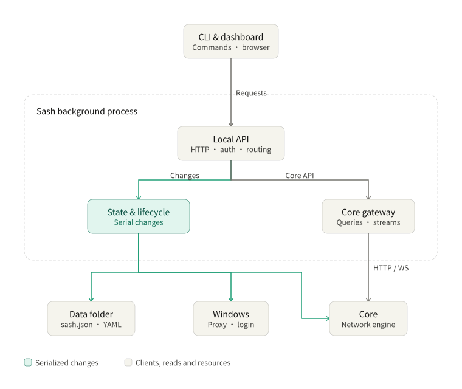

# Backend Architecture

Sash runs one background process per data folder. The CLI and dashboard use its local API; this process saves application state and manages Core.

[Usage](./usage.md) · [Frontend](./frontend.md) · [Start at login](./autostart.md)

## Responsibilities

[daemon/entry.ts](../src/daemon/entry.ts) acquires the instance lock, loads state and recovers interrupted Core/proxy operations before opening the listener. The local API and dashboard work even when Core is missing or stopped.

[daemon/app.ts](../src/daemon/app.ts) connects the services. [DaemonGate](../src/daemon/context.ts) serializes saved-state and lifecycle changes in memory. Reads and live Core requests run independently. Downloads prepare outside the queue; publication checks that the saved state and runtime still match the operation's starting point.

| Area | Main source | Responsibility |
| --- | --- | --- |
| Local API | [router.ts](../src/daemon/router.ts), [handlers.ts](../src/daemon/handlers.ts) | Authenticate, parse requests and call services |
| Saved state | [app-state.ts](../src/app-state.ts) | Commit settings, profile metadata and selection atomically |
| Settings and profiles | [settings-service.ts](../src/settings-service.ts), [profile-service.ts](../src/profile-service.ts) | Validate input and save changes |
| Core lifecycle | [runtime-lifecycle.ts](../src/runtime-lifecycle.ts), [supervisor.ts](../src/supervisor.ts) | Apply configuration, start/stop Core and check readiness |
| Core installation | [core.ts](../src/core.ts), [core-update.ts](../src/core-update.ts) | Download, verify, replace and recover the executable |
| Desktop integration | [system-proxy-manager.ts](../src/system-proxy-manager.ts), [autostart.ts](../src/autostart.ts) | Windows proxy restoration and start at login |
| Observation | [events.ts](../src/daemon/events.ts), [doctor.ts](../src/doctor.ts) | Shared status events and independent diagnostic checks |

CLI discovery uses the running instance's observed port. Process locks coordinate instance startup and per-user Windows operations; ordinary application writes use the in-memory queue.

## Saved state and profiles

`sash.json` contains `{schemaVersion: 2, revision, settings, profiles}`. `profiles` holds the saved `activeId` and metadata; source text lives in `profiles/<id>/<revision>.yaml`. [SashStateStore](../src/app-state.ts) keeps one frozen committed state, replaces it after a successful atomic write, and maintains `sash.json.bak` as a recovery copy.

Saving a profile writes the new source file before committing its reference. Deleting a profile commits removal before cleaning up files. Identical content retains its revision. Editor saves include the revision read on open; settings saves can include `expectedRevision`. Stale edits return `409`.

Profile reads return raw text, so damaged YAML can be opened for repair. Import, save, activation and Apply parse YAML when needed; the document must be an object. Core's pre-flight check decides whether the generated configuration is usable. State is capped at 2 MiB and each profile at 8 MiB.

Remote updates share one in-flight download per profile. Scheduled failures back off from 15 minutes to one day; manual updates bypass that delay. Success clears the failure count. Maintenance removes recognized, unreferenced generated files after a 24-hour grace period.

`runtime/config.yaml` is generated from the saved profile, or a DIRECT-only default when none is selected. Source text stays unchanged. Sash supplies the proxy port, controller credentials and LAN setting, removes competing controller endpoints and tunnels, and sets `tun.enable` to `false`.

See [State format and data](./usage.md#state-format-and-data) for settings and paths.

## Save, Apply and stop

| Action | Effect |
| --- | --- |
| Save settings, select/edit/update a profile | Save for the next Apply |
| Apply / `sash restart` | Start Core with the saved configuration, restarting it if running |
| Change mode or select a node | Change the running Core |
| Toggle system proxy | Save the preference and reconcile Windows immediately |
| Stop Core | Restore the prior proxy and stop Core; keep Sash available |
| `sash stop` | Restore the prior proxy, stop Core and close Sash |

Apply runs in this order:

1. Generate a candidate and run Core's configuration check.
2. Restore the prior system proxy.
3. Stop the verified Core and check that its controller port is free.
4. Atomically publish the core config.
5. Start Core and wait for its controller to report the expected version.
6. Apply the saved system-proxy preference to the running proxy port.

Validation or proxy-restoration failure leaves the current Core running. A later startup failure preserves saved edits and keeps the local API available for correction. Enabling the system proxy requires a healthy Core; disabling saves the off preference before restoration, so a failed restoration can be retried.

Core downloads its own geodata during the configuration check and ignores `HTTP_PROXY`. A geodata download failure triggers one retry with mirror `geox-url` values; Sash applies that retried configuration. See [troubleshooting](./usage.md#status-and-troubleshooting) if the retry fails.

Stopping Core cancels its preparation work. Full shutdown also cancels profile downloads, rejects new changes and drains active work before restoring the proxy and stopping Core. Cleanup failure leaves Sash available for retry. Unexpected Core exits trigger bounded proxy-restoration retries.

## Updates

Core updates download an unmodified release artifact selected by official GitHub metadata. HTTPS origins and redirects must be allowlisted; the archive is checked against the release API's SHA-256 while streaming. Extraction rejects path traversal. Download and extracted-output limits are 128 MiB and 512 MiB.

On x64, staging tries available builds in preference order and runs each with `-v` to find one the processor supports. ARM64 uses its native build. Configuration validation finishes before the queued binary replacement.

[core-update.ts](../src/core-update.ts) records replacement progress in `state/core-update-transaction.json` and keeps the previous executable as `.bak` through the health check. Failure restores the binary, install record and prior running state; startup recovers interrupted replacements. An update requested while Core is stopped starts it briefly for verification, then stops it again.

Sash package upgrades use [self-upgrade.ts](../src/self-upgrade.ts). npm installs one exact version **while Sash keeps running**, then Sash restarts to load it. `--no-restart` leaves the current process running. npm owns package integrity; a failed install leaves the running instance available. Commands and supported installations are covered in [Updates](./usage.md#updates).

## Local API

The listener binds to `127.0.0.1`. [router.ts](../src/daemon/router.ts) lists every route and method; [contracts.ts](../src/contracts.ts) and [SashClient](../src/sash-client.ts) define request and response types.

| Path | Purpose |
| --- | --- |
| `/sash/daemon/health`, `/sash/daemon/status` | Process identity and runtime status |
| `/sash/events` | Authenticated status stream (SSE) |
| `/sash/daemon/shutdown` | Full shutdown |
| `/sash/settings`, `/sash/profiles`, `/sash/profiles/*` | Saved settings, profile content and selection |
| `/sash/core/*` | Start, Apply, stop, update, mode and delay tests |
| `/sash/proxy`, `/sash/autostart` | Windows integration |
| `/sash/web/*` | Browser authorization and session renewal |
| `/core/api/*` | Authenticated Core queries, node selection, connection deletion and WebSocket streams |
| `/ui/*` | Bundled dashboard |

Health, status and proxy observations allow public reads; private profile URLs require authentication. Settings, profiles, control operations, events and the Core gateway require a CLI bearer or browser session. Browser session exchanges authenticate with the token in their request body. Errors use `{error: {code, message}}`; successful empty responses use `204`.

Status separates saved and running configuration through `configuration: {pending, appliedProfile, appliedSettings}`. `daemon.bootId` identifies Sash; `revisions.state` tracks saved changes and `revisions.runtime` tracks Core replacement.

SSE sends complete `{schemaVersion: 1, sequence, status, autostart}` snapshots. One shared observer samples external changes while clients are connected and publishes changes after mutations. Reconnection starts with a complete snapshot; slow clients retain only the newest pending snapshot.

`sash status --watch` consumes this stream and rediscovers Sash after a restart. Latency tests run only when explicitly requested, independently of status sampling.

## Windows and security boundaries

- **Processes:** verify the executable path before signaling a PID; uncertain ownership preserves the process record.
- **Transport:** check loopback Host/Origin and send controller traffic directly, independently of remote-download proxy settings.
- **Credentials:** the browser uses a private session; the gateway substitutes the Core credential. Child environments are scrubbed. Only the Sash background process receives `GITHUB_TOKEN`/`GH_TOKEN` for release downloads.
- **Persistence:** state writes use [fs-atomic.ts](../src/fs-atomic.ts). Private state/logs use POSIX `0600`; log appends do not follow symlinks.
- **System proxy:** save original Windows proxy/PAC values before writing. Restore values Sash still owns, preserving later changes made by another application. A per-user lock coordinates different data folders.
- **Start at login:** the Windows current-user registration launches Sash without a console window. See [Automatic Startup](./autostart.md).

Browser authorization starts with a 90-second, single-use handoff from `sash web`. Sessions use a twelve-hour sliding idle limit. Stored session hashes allow an authorized tab to continue across Sash restarts; the browser presents its existing token to renew access. See [Frontend authorization](./frontend.md#authorization-and-transport).
