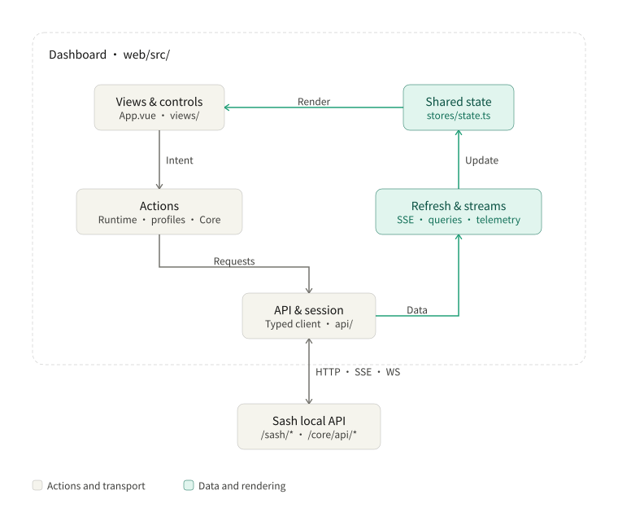

# Frontend Architecture

The Vue 3 / Vite dashboard lives in `web/src/`, builds to `dist/ui/` and is served by Sash at `/ui/`.

[Usage](./usage.md) · [Backend](./backend.md) · [Start at login](./autostart.md)



## State and actions

[stores/state.ts](../web/src/stores/state.ts) holds shared shallow-reactive state. Large collections are replaced by reference. [stores/index.ts](../web/src/stores/index.ts) exposes actions and selectors to views.

| Module | Responsibility |
| --- | --- |
| [runtime-actions.ts](../web/src/stores/runtime-actions.ts) | Adopt status and save settings |
| [profile-actions.ts](../web/src/stores/profile-actions.ts) | Save profiles and refresh metadata |
| [core-actions.ts](../web/src/stores/core-actions.ts) | Load Core resources and control mode, nodes and connections |
| [runtime-events.ts](../web/src/stores/runtime-events.ts) | Subscribe to status and schedule resource refreshes |
| [telemetry.ts](../web/src/stores/telemetry.ts) | Keep traffic history and bounded log batches |
| [api/](../web/src/api/) | Authorize the tab and transport requests and streams |

Refreshes follow three values from Sash:

| Value | When it changes |
| --- | --- |
| `daemon.bootId` | Reconnect to the new Sash process and reset saved-state comparisons |
| `revisions.state` | Refresh profile metadata |
| `daemon.bootId` + `revisions.runtime` | Clear the replaced Core's resources, traffic and manual latency results |

Each Core resource has its own loading state and error. A failed query preserves that resource's previous data and marks it stale; other resources remain usable. Stopping or replacing Core clears its data.

## Refresh and streams

Sash status arrives through authenticated SSE at `/sash/events`. A connection starts with a full snapshot. Core tables use a separate, non-overlapping two-second refresh schedule for the current page.

| Page | Background work |
| --- | --- |
| Overview | Config/mode and proxies every third cycle; connections every fifth |
| Connections | Connections each cycle |
| Rules | Load on entry or Core replacement, then cache |
| Profiles / Settings | Saved metadata; no periodic Core table reads |
| Logs | Log stream while visible |

Page entry loads the relevant resources immediately. Saving a profile refreshes metadata; Apply refreshes visible Core resources after replacement. Traffic uses one shared WebSocket for visible consumers. Traffic and log streams pause when hidden or when the session/Core is unavailable.

Unchanged proxy data retains its references. Lists use memoization, pagination or content visibility where useful. Logs are batched and capped at 600 rows. Routes, the YAML editor and font slices load on demand.

## Views and controls

[App.vue](../web/src/App.vue) owns navigation, the session gate, the pending-configuration bar and shared stream lifetime. Pages cover Overview, Profiles, Logs, Connections, Rules and Settings.

[CoreControls.vue](../web/src/components/CoreControls.vue) shares start, stop and Apply behavior through [useCoreControl](../web/src/composables/core-runtime.ts). Apply asks for confirmation when it restarts a running Core.

Profiles shows the saved selection; Overview shows the configuration Core is using. The editor saves against the content revision read on open. Settings drafts stay local until Save and survive status refreshes. The system-proxy switch acts immediately and remains available for restoration when Core is stopped.

Shared dialogs provide focus trapping, Escape handling and focus return. The dashboard supports Chinese/English, light/dark themes and mobile navigation.

## Authorization and transport

[api/session.ts](../web/src/api/session.ts) consumes the one-time handoff from `sash web`, removes it from the URL and stores the resulting session in `sessionStorage`. If storage is unavailable, the current page keeps the session in memory. A bare dashboard URL displays connection instructions.

[api/index.ts](../web/src/api/index.ts) uses the browser-safe [SashClient](../src/sash-client.ts). HTTP and SSE carry `X-Sash-Token`; WebSockets use a private authentication subprotocol. Sash forwards Core requests using its own controller credential.

SSE checks stream framing, sequence and process identity. Traffic/log frames are bounded and checked before entering shared state. Reconnects release old readers and ignore frames from replaced runtimes. Existing sessions can continue across Sash restarts.

## Development and verification

From a source checkout:

```sh
node scripts/dev.mjs web      # open the development dashboard
node scripts/dev.mjs build    # rebuild after UI edits, then refresh
node scripts/dev.mjs stop     # stop before loading backend changes
node scripts/dev.mjs web
```

The launcher uses a separate `-dev` data folder and initial ports `18890`, `18990` and `28990`. Set an absolute `SASH_DEV_HOME` to choose another folder. `web` starts Sash; `restart` applies the saved configuration and starts Core.

Run `npm run typecheck`, `npm run lint` and affected tests after code changes. After building, use `npm run smoke:ui` and the relevant browser check: `verify:ui`, `verify:ui:profiles`, `verify:ui:auth` or `verify:ui:autostart`.

Browser checks share [ui-harness.mts](../scripts/ui-harness.mts), with temporary data, non-default ports and Core/OS fixtures. Check both Chromium and Firefox. [ui-shot.mjs](../scripts/ui-shot.mjs) captures routes for visual inspection.

Font build setup lives in [build-ui.mjs](../scripts/build-ui.mjs). Bundled licenses are in [THIRD_PARTY_NOTICES.md](../THIRD_PARTY_NOTICES.md) and [remix-icon-license.txt](./remix-icon-license.txt).
